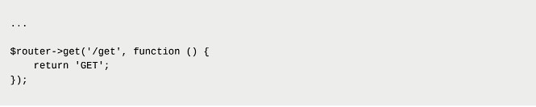
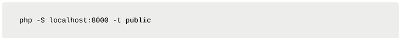
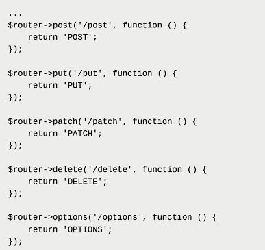
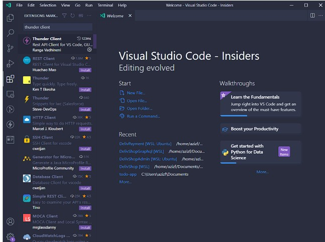
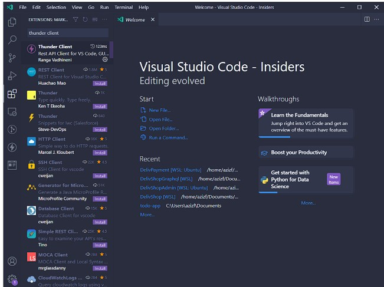
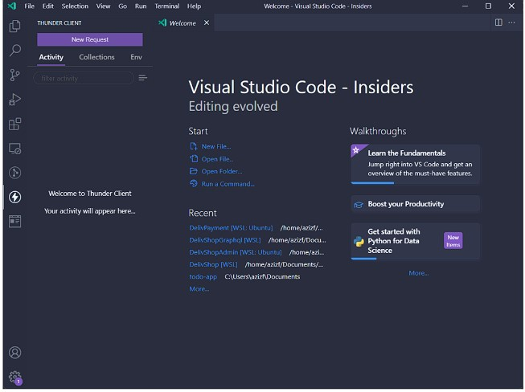
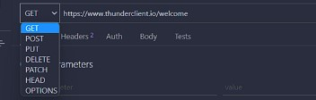
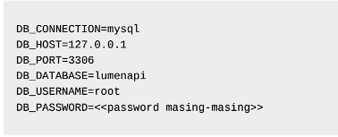
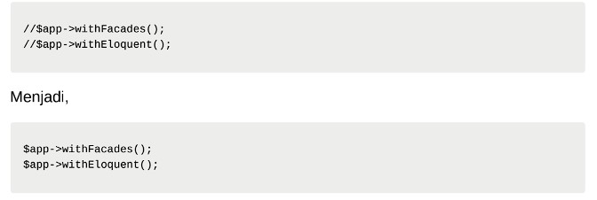
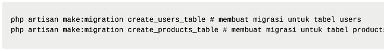

Basic Routing dan Migration
------------------------------------------------
Langkah 1) Untuk menambahkan endpoint dengan method GET pada aplikasi kita, kita dapat
mengunjungi file web.php pada folder routes. Kemudian tambahkan baris ini pada akhir
file

Latihan 2)LPOST, PUT, PATCH, DELETE, dan OPTIONS
Sama halnya saat menambahkan method GET, kita dapat menambahkan methode
POST, PUT, PATCH, DELETE, dan OPTIONS pada file web.php dengan code seperti
ini,

. 
Latihan 3)Migrasi Database
a. Sebelum melakukan migrasi database pastikan server database aktif kemudian
pastikan sudah membuat database dengan nama lumenapi
b. Kemudian ubah konfigurasi database pada file .env menjadi seperti ini

Setelah mengubah konfigurasi pada file .env, kita juga perlu menghidupkan
beberapa library bawaan dari lumen dengan membuka file app.php pada folder
bootstrap dan mengubah baris ini,

Setelah itu jalankan command berikut untuk membuat file migration,

